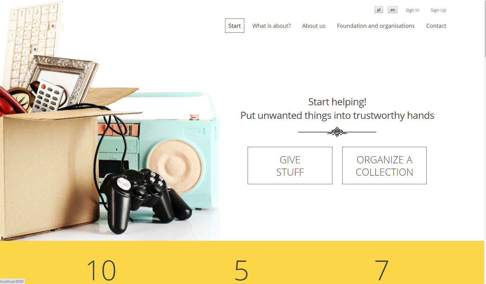
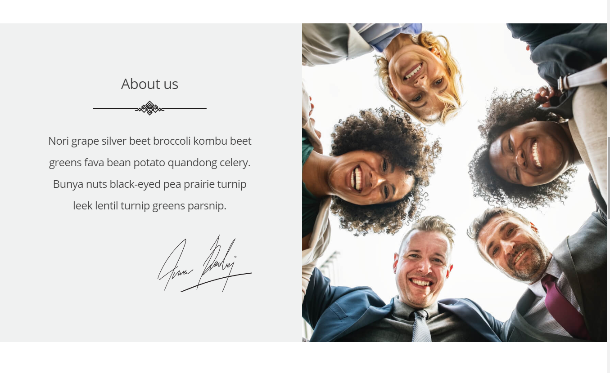
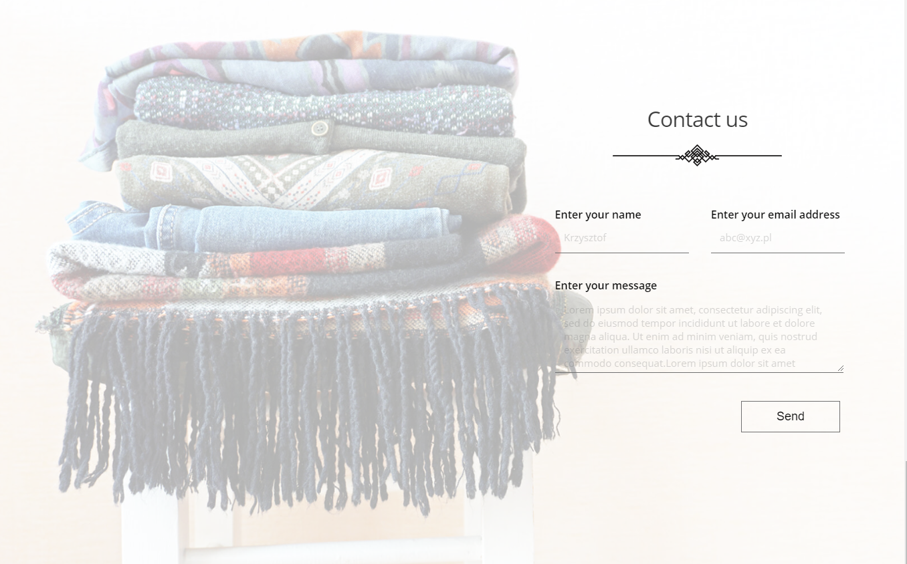
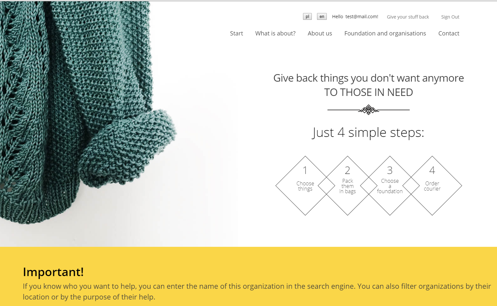
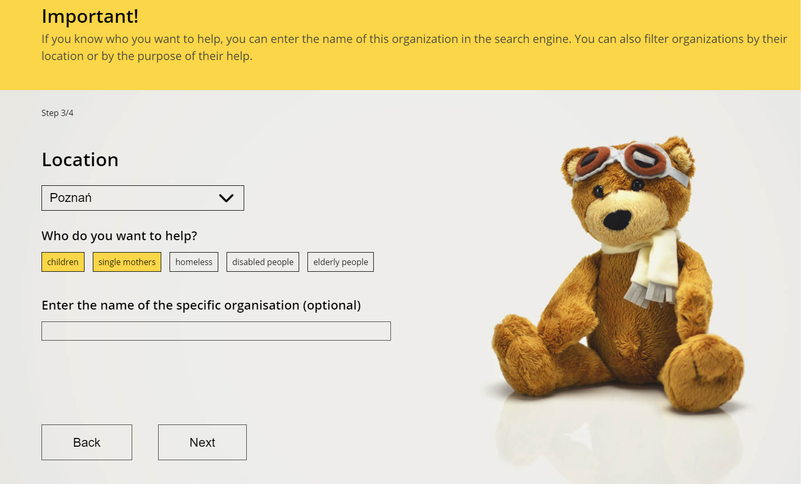

# Oddam w dobre ręce

> Portfolio Lab project

## Table of contents

- [General info](#general-info)
- [Screenshots](#screenshots)
- [Technologies](#technologies)
- [Setup](#setup)
- [Features](#features)
- [Status](#status)
- [Contact](#contact)

## General info

The aim of the project is to create a place where everyone will be able to give unnecessary things to trusted institutions.
The project will be a **website** with a simple form that will make it easier for users to give things back.

## Screenshots

## Technologies

- JavaScript
- React - version 16.10.2
- Redux - version 4.0.4
- React i18next - version 17.3.0
- Sass
- HTML
- CSS
- Firebase

## Setup

This project was bootstrapped with [Create React App](https://github.com/facebook/create-react-app).

### Available Scripts

In the project directory, you can run:

### `npm start`

Runs the app in the development mode. 
Open [http://localhost:3000](http://localhost:3000) to view it in the browser.

The page will reload if you make edits. 
You will also see any lint errors in the console.

### `npm test`

Launches the test runner in the interactive watch mode. 
See the section about [running tests](https://facebook.github.io/create-react-app/docs/running-tests) for more information.

### `npm run build`

Builds the app for production to the `build` folder. 
It correctly bundles React in production mode and optimizes the build for the best performance.

## Code Examples

Show examples of usage:
`put-your-code-here`

## Features

List of features ready and TODOs for future development

- Home Page and Form layout
- Login, registration, logging out with authentication using Firebase
- Form - validation and adding to Firebase
- Internationalization (Polish, English)

To-do list:

- Mobile version
- Administration Panel
- Internationalization (Russian)

## Status

Project is: _in progress_

## Contact

Created by Joanna Chądzyńska joanna.chadzynska20@gmail.com - feel free to contact me!
